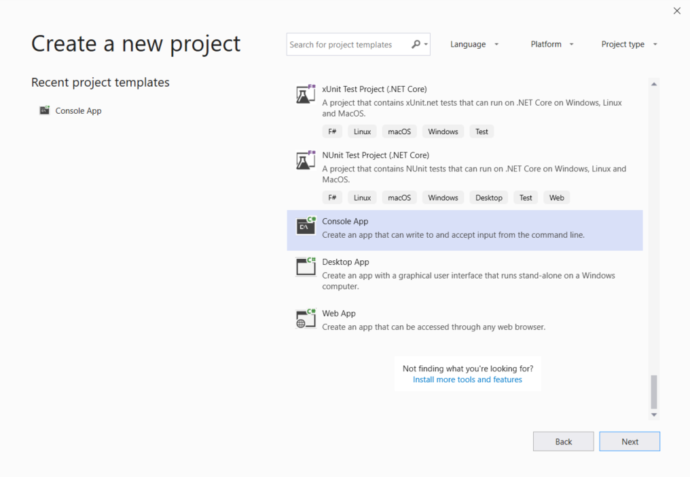
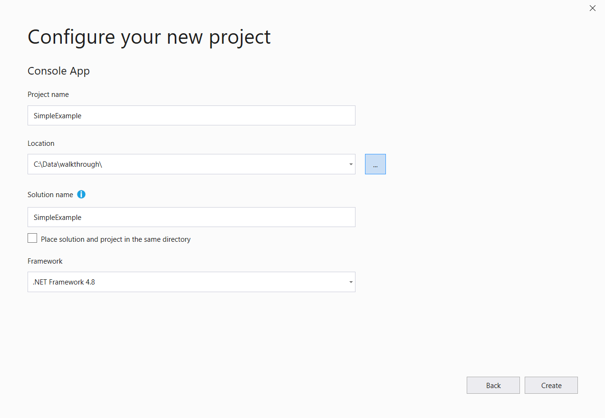
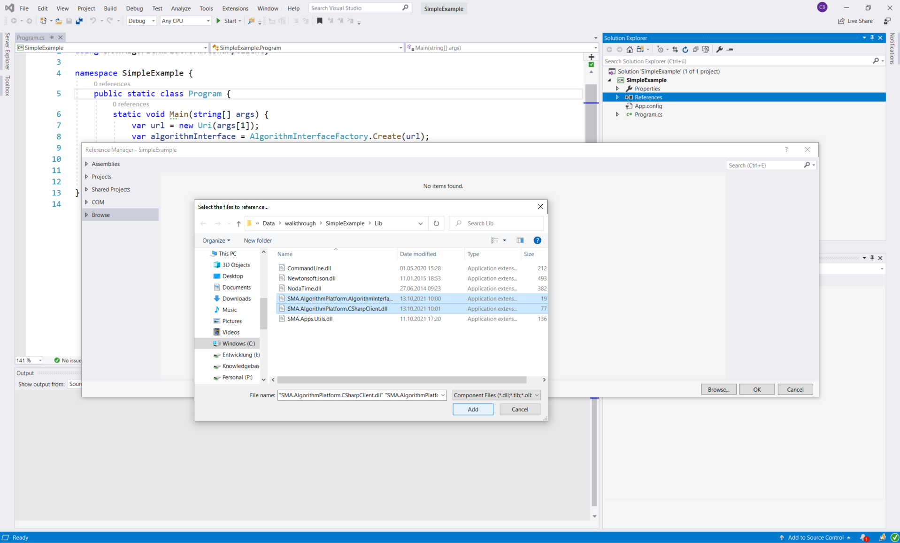
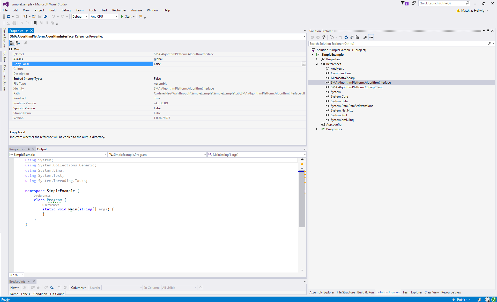

# Walkthrough Creating an Algorithm Using the C# Client

In this walkthrough we will create a 32-/64-bit (anyCPU) algorithm using the IAlgorithmInterface (see the IAlgorithmInterface documentation for more information) of the SMA Algorithm Platform via the CSharp client delivered with AlgorithmPlaform.

Here's an overview of what we will do.

* Create a solution.
* Copy libraries `\Extension\AlgorithmPlatform\algorithms\Lib` of the `SMA.Viriato.Standard-AlgorithmResearch-8.XX.XX` that comes in the Algorithm Platform SDK.
* Add `SMA.AlgorithmPlatform.AlgorithmInterface` and `SMA.AlgorithmPlatform.CSharpClient` as references.
* Implement a main method stub.
* Build and deploy the algorithm by publishing it to the SMA Algorithm Platform via a configuration setting.


## Creating a Solution 

Set up a Visual Studio solution and project by selecting 'Create a new project'. 



Create a new Console Application and assign it a name. In our walkthrough we call the solution `SimpleExample`. 



Make sure you use the framework version `.Net Framework 4.8`, otherwise you could have trouble loading librairies.

Confirm the creation by pressing button 'OK'.

## Copying Libraries and Adding References

Copy the directory `Lib` being a subfolder of `${PathToAlgorithmPlatform}\Extension\AlgorithmPlatform\algorithms` to the folder of your newly created solution where the class with the main method resides, e.g. `SimpleExample.sln`. Add the references `SMA.AlgorithmPlatform.AlgorithmInterface` and `SMA.AlgorithmPlatform.CSharpClient` by right clicking on 'References' and selecting 'Add reference...' in the 'solution explorer'. 



Set the 'copy local' property of both to `false`.



We will not need the libraries being copied as they already exist in `${PathToAlgorithmPlatfrom}\Extension\AlgorithmPlatform\algorithms\Lib`, which is the place where we have taken them from.

Finally, change the contents of the `App.config` file of your solution to
```XML
<?xml version="1.0" encoding="utf-8" ?>
<configuration>
  <runtime>
    <assemblyBinding xmlns="urn:schemas-microsoft-com:asm.v1">
      <probing privatePath="Lib" />
    </assemblyBinding>
  </runtime>
</configuration>
```
which ensures that the libraries will be found later when we deploy the algorithm.

## Implementing a Main Method

Now go to your main class and implement the main method as follows
```C#
using System;
using SMA.AlgorithmPlatform.CSharpClient;

namespace SimpleExample {
    public static class Program {
        static void Main(string[] args) {
            var url = new Uri(args[1]);
            var algorithmInterface = AlgorithmInterfaceFactory.Create(url);

            algorithmInterface.NotifyUser("Hello World Algorithm", "Hello Algorithm World!");
        }
    }
}
```

Here we see three things happen.

* We create an URI from the first command-line argument. When the Algorithm Platform invokes the algorithm it will automatically pass `-u http://localhost[:port]` as argument, where `[:port]` is the port under which the Algorithm Platform is available.
* Using the AlgorithmInterfaceFactory we create an IAlgorithmInterface, which is our interface to communicate with the Algorithm Platform.
* In the last line we invoke a method on the IAlgorithmInterface notifying the user and displaying a message. This is a first interaction of the algorithm with the Algorithm Platform.


## Build and Deploy

Now build your solution in Visual Studio. Copy the build artifacts from `${PathToSolution}\bin\Debug` into folder `${PathToAlgorithmPlatform}\Extension\AlgorithmPlatform\algorithms`. The `App.config` file which you have modified earlier now ensures that the algorithm has access to the library files in `${PathToAlgorithmPlatform}\Extension\AlgorithmPlatform\algorithms\Lib`. 

Now we need to make the algorithm known to Algorithm Platform by adding a configuration entry 
```json
{
      "name": "SimpleExample",
      "workingDirectory": "../algorithms",
      "command": "SimpleExample.exe",
      "arguments": "-u {ApiUrl}"
}
```

into the `${PathToAlgorithmPlatform}\Extension\AlgorithmPlatform\Configuration\algorithms.json` file in the list `algorithms` (see the article Deploying Algorithms for more details). 
Save the file and start the Algorithm Platform. This process is more detailed in the article Algorithm Platform and Viriato. 

# Source Code

You find the source code for the [SimpleExample](../SimpleExample/Program.cs) attached.